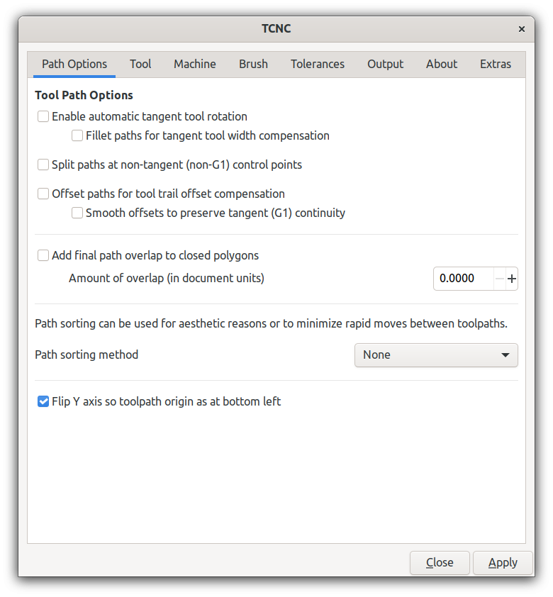
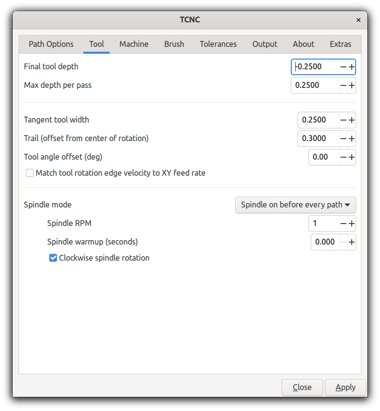
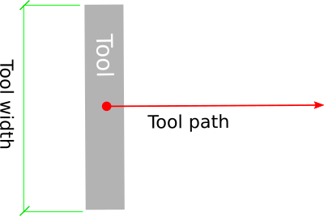
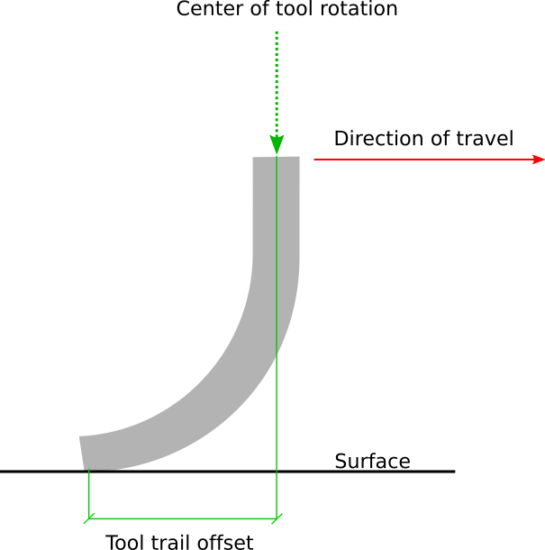
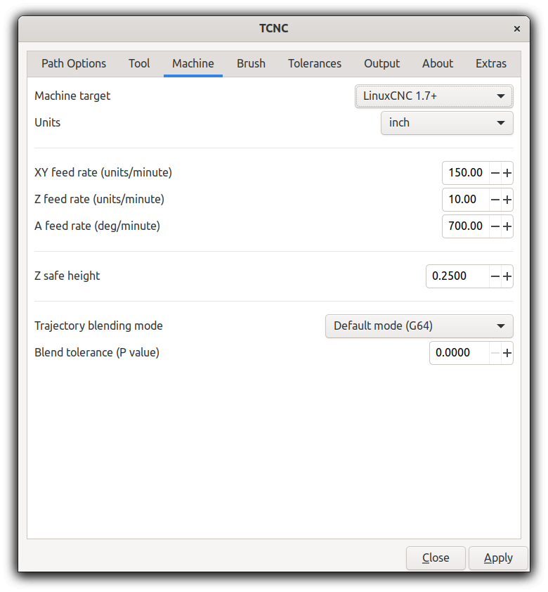
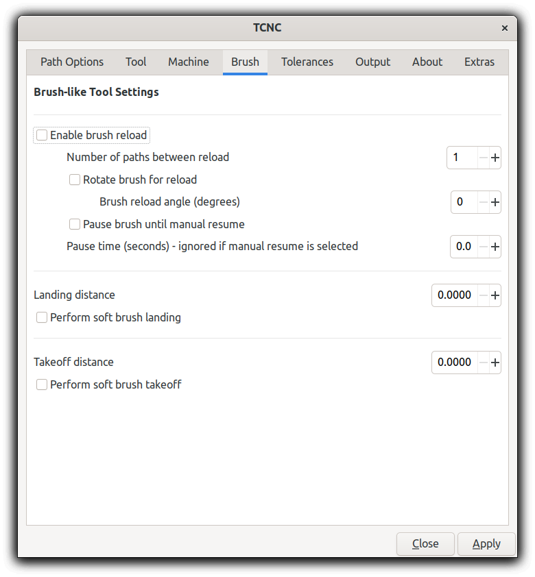
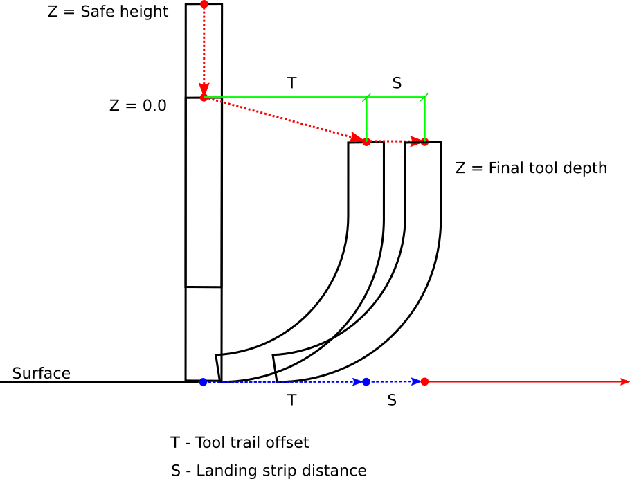
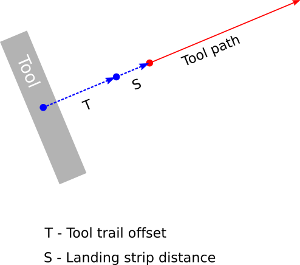
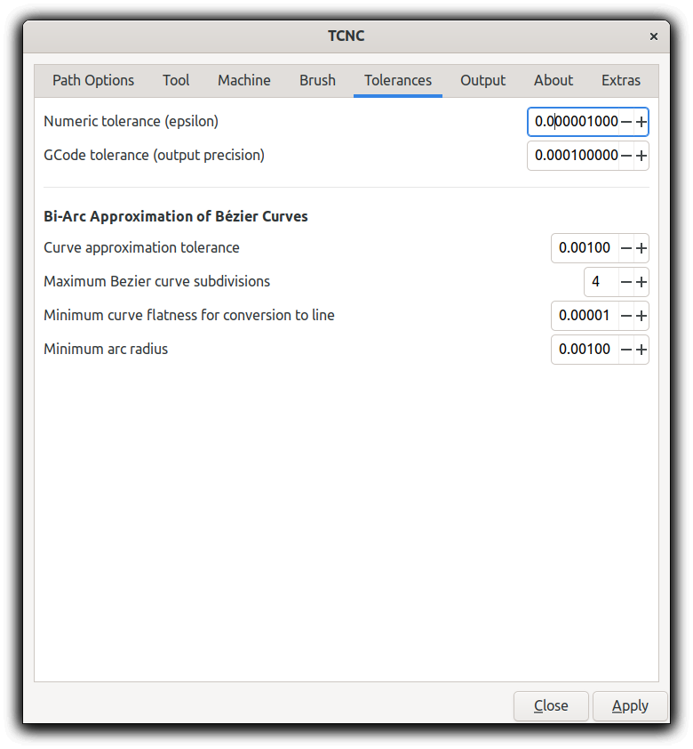
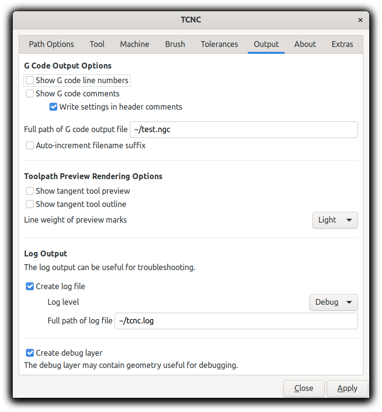

==========
TCNC Usage
==========

TCNC is designed as an Inkscape extension
but can be also invoked as a standalone program from
the command line to create G code from an SVG file.
It does not require Inkscape to be installed to run.

Units
=====

SVG has a concept known as **user units** which refers to the numeric values
used to specify things like coordinates, distances, and dimensions.
These values are scaled based on the viewBox attribute of the SVG root element.
The SVG document size is specified using the SVG height and width
attributes and they can be expressed using any valid SVG unit, such
as **pt**, **px**, **in**, etc. This is referred to here as the
**document unit**.
Inkscape also has a **display unit** which is what is used for rulers.

G code units are either imperial or metric and specified as
**inches** (G20) or **millimeters** (G21).

Together the **document unit**, **user unit**, **viewBox**, **display unit**,
and **G code unit**
can produce a beautiful (maddening) confusion. If these do not match
it becomes difficult to infer the user's intention with regards to
scaling. In general, it is less confusing if the SVG units and drawing scale 
match the expected G code output.

TCNC will convert between the
SVG document unit and the G code unit and further scale using the
viewbox values.
The viewbox aspect ratio must match the SVG width/height ratio.

To make things simple and to avoid conversion and scaling surprises
it is recommended to specify the SVG drawing/document size using
the G code unit (ie **in** or **mm**) and make the viewbox match the
document size.

TCNC Inkscape Extension
=======================

To prepare a document to use with TCNC, set the **display units** in
**File->Document Properties...** to either **in** or **mm** and use the
same unit to specify the document size. 
Set scale to 1.0 to make the viewbox match the document.
This is optional but strongly recommended since it
helps to avoid unexpected unit conversion and scaling issues.

Select a path in Inkscape or select a layer if you want everything on that
layer to be processed. If nothing is selected then all visible objects will
be processed. From the **Extensions** menu select
**UTLCo** -\> **TCNC..** and the **TCNC** extension dialog will appear.

TCNC only processes paths or basic shapes (circles, arcs, ellipses, rectangles,
and spirals). Ellipses will be converted to Bezier curves before before conversion
to circular arcs (biarcs). Text or other objects will be ignored.

The TCNC dialog
---------------

Tool Path Options
.................

Enable tangent rotation
'''''''''''''''''''''''

The A axis is automatically rotated during a feed so that the tool is
always tangent to the direction of the XY movement. The A axis is assumed to
rotate about the Z axis.

If not selected, the A axis will rotate to the initial
A axis offset (if any) and stay at that angle.

Fillet paths for tool width compensation
''''''''''''''''''''''''''''''''''''''''

Useful for wide brush-like tools. This will modify the path to add fillet arcs
at corners to compensate for the tool width. It mitigates rotational
artifacts caused by the wider tools.

This option is ignored if tangent rotation is disabled.

Close polygons with fillet
''''''''''''''''''''''''''

Adds a fillet between the end of the last segment of a path and
the start of the first segment. Only applies if fillets are enabled.

Split paths at non-tangent control points
'''''''''''''''''''''''''''''''''''''''''

Split a path at non-tangent (no G1 continuity) control points (vertices).
This is performed after any offsetting or filleting and
creates separate tool paths for remaining non-tangent path sections. 

Offset paths for tool trail offset compensation
'''''''''''''''''''''''''''''''''''''''''''''''

Offsets the path segments to compensate for tool trail offset.
Tools with a trail offset will follow the original path much more closely
at the cost of tool path complexity and possible acceleration/deceleration
artifacts.

Add final smoothing fillets
'''''''''''''''''''''''''''

This will add small fillets to non-tangential vertices of the path
after offsetting.
Probably not useful if the machine already provides trajectory blending.

Add final path overlap to closed polygons
'''''''''''''''''''''''''''''''''''''''''

Adds a segment to the end of a path that defines a closed
polygon to overlap the start segment.

Path sorting method
'''''''''''''''''''

Sort paths for aesthetic reasons or to minimize rapid moves between
tool paths.

- Flip paths
   Use original path order but flip (reverse) paths to shorten rapid moves.
- Bottom to top, left to right
   Sorts the paths from bottom to top and secondarily left to right.

Flip Y axis
'''''''''''

Flip Y axis so that the tool path origin is at the lower left.
This matches more closely the expected machine coordinates.

By default the SVG (and Inkscape) coordinate system sets the origin
at the top left corner of the document. This makes it awkward to
visualize the tool travel since most CNC machines set the origin
at the lower left of the XY plane.

Tool Options
............

Final depth
'''''''''''

The final tool depth of the last pass. Depth per pass and final depth can
be the same if just one pass is required.

Depth per pass
''''''''''''''

Maximum Z depth per pass if multiple passes are needed per path.
This value can be negative or positive - the absolute value will used used
as distance of travel towards the final depth.
Ignored if the value is zero.

.. _tool-width:

Tool width
''''''''''

Width in document units of the tangential tool such as a brush,
scraper, or squeegee.
This will determine fillet radius if tool path compensation fillets are enabled.

   Fig 2. Tool width

.. _trail-offset:

Trail offset
''''''''''''

Tool trail offset is the distance from the center of rotation to the
point of contact with the surface. Flexible tools such as brushes
and scrapers will deflect when brought to the work surface. This
creates a trailing point of contact and will cause unwanted behavior
when making relatively tight turns. TCNC will try to recalculate the
path to compensate for this so that the center of contact follows
the original path more closely.

   Fig 3. Tool trail offset

Tool angle offset
'''''''''''''''''

Offset in degrees of the A axis.

Match tool rotation edge velocity
'''''''''''''''''''''''''''''''''

Adjust angular feed velocity so that angular velocity of the the
outer rotating tool edge matches the XY feed velocity.
This is only relevant for non-zero width tangent tools.

Spindle mode
''''''''''''

- No spindle
- Spindle on at start
- Spindle on before every path

Spindle RPM
'''''''''''

Spindle speed in revolutions per minute.

Spindle warmup
''''''''''''''

Time in seconds to wait for the spindle to get up to speed and warm up.

Clockwise spindle rotation
''''''''''''''''''''''''''

Direction of spindle rotation. Default is clockwise.

Machine Options
...............

Machine target
''''''''''''''

G code interpreter. This is LinuxCNC v1.7+ by default.

Other interpreters may or may not be supported.

Units
'''''

G code (machine) units. These can be inches or millimeters.

- Infer from document
   Inches or mm inferred from document units. For example if the document
   is in imperial units then inches will be used, otherwise mm.
- inch
- mm

XY feed rate
''''''''''''

The feed rate of the X and Y axes. In machine units per minute.

Z feed rate
'''''''''''

The Z axis (vertical) feed rate. In machine units per minute.

A feed rate
'''''''''''

The A (rotational) axis feed rate. In degrees per minute.

Z safe height
'''''''''''''

The safe height, in machine units, of the Z axis for rapid moves.

Trajectory blending mode
''''''''''''''''''''''''

Tool path blending mode used by the machine controller.

- Default (G64)
   The default blending mode which is usually G64 - blending with a default
   tolerance.
- Blend with tolerance (G64 P`t`)
   G64 blending with a specified tolerance.
- Exact path (G61)
   Follow the exact path with no blending. Accurate but can be slow.
   The tool may come to a complete stop at path vertices.

Blend tolerance
'''''''''''''''

The blend tolerance (P) value when using the G64 P`t` blend mode.

Brush Options
.............

Enable brush reload
'''''''''''''''''''

Brushes often require more paint and this enables a brush reload sequence for
manual brush reloading. Automated brush reloading is not currently supported
since it would be extremely machine dependent.

Number of paths between reload
''''''''''''''''''''''''''''''

Number of paths to output before a reload sequence is performed.

Rotate brush for reload
'''''''''''''''''''''''

Rotate the brush to the specified reload angle before each path.

Pause brush until manual resume
'''''''''''''''''''''''''''''''

Issue a pause command which will wait until the user starts/unpauses
the machine. Usually this is done via Axis or some other UI.

Brush pause time
''''''''''''''''

Amount of time in seconds that the tool feed will pause to allow
manual reloading of the brush. This is ignored if manual resume
is enabled.

Landing distance
''''''''''''''''

Prepend a line segment of this length to the tool path that is
tangent to the first tool path segment.

   Fig 4. Soft landing Z axis trajectory

Perform soft brush landing
''''''''''''''''''''''''''

A flexible tool such as a brush will develop its trail distance only after
touching and pressing into the work surface. This will use the Z depth and
landing distance to create a ramp trajectory along the Z and XY axes.

   Fig 5. Soft landing XY axis trajectory

Takeoff distance
''''''''''''''''

Append a line segment of this length to the tool path that is
tangent to the last segment of the tool path.

Perform soft brush takeoff
''''''''''''''''''''''''''

Create a ramp trajectory along the takeoff segment, rising along the
Z axis to the Z safe height.

Tolerance Options
.................

Numeric tolerance
'''''''''''''''''

This determines the numeric tolerance (epsilon) of floating point comparisons.

G code tolerance
''''''''''''''''

The G code output precision. Determines the maximum number of digits after the
decimal point.

Curve approximation tolerance
'''''''''''''''''''''''''''''

The maximum distance, in document units, between the approximation and
the original curve.
Smaller values can result in more accurate approximations but at the expense
of slower performance.

Maximum Bezier curve subdivisions
'''''''''''''''''''''''''''''''''
Inkscape paths consist of Bezier curves and to accurately approximate them
with circular arcs they may need to be broken down into smaller curves.
Larger values can result in more accurate approximations but at the expense
of slower performance.

Curve to line flatness
''''''''''''''''''''''

Curves that are flatter than this will be approximated by a straight line.
Flatness is the maximum distance from a line between the curve end points
and the curve.
In document units.

Minimum arc radius
''''''''''''''''''

Arcs with a radius smaller than this will be replaced by a straight line.
In document units. This can avoid unexpected rotations of the tangential
tool when encountering tiny spurious curves that might be in the input path.

Output Options
..............

Full path of G code output file
'''''''''''''''''''''''''''''''

Add numeric suffix to filename
''''''''''''''''''''''''''''''

Preview line scale
''''''''''''''''''

